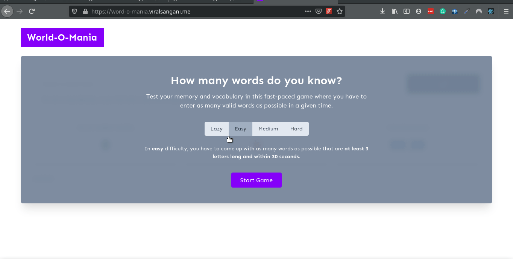

    
     

💻 A simple game to test your vocabulary and your memory, with a little bit of fun.
Let's see what are all the words that you know? 🎮

    Project URL - <a href="https://word-o-mania.viralsangani.me/">https://word-o-mania.viralsangani.me/</a>

# A ReactJs Game

# Demo

## Play the Game

### [https://word-o-mania.viralsangani.me](https://word-o-mania.viralsangani.me)

## How To Play

In easy difficulty of the game, you have 30 seconds to note down almost every word you can remember that are at least 3 letters long. Your score is calculated by the number of correct/incorrect words you have submitted. Similarly, in medium and hard difficulty, the time limits and minimum word lengths are 45s/6 and 60s/8 respectively.

## Screenshots

### 💜 Thanks

Special thanks to [@tanaypratap](https://github.com/tanaypratap) sir, and [2020.teamtanay.jobchallenge.dev](https://github.com/tanaypratap/teamtanay.jobchallenge.dev) for encouraging student like me to create amazing projects and help us to grow.
